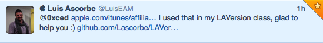
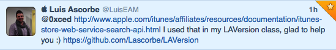

## About

Twitter [Developer Display Requirements](https://dev.twitter.com/terms/display-requirements) are forcing Twitter client developers to display truncated URLs. **Twexpand** is a SIMBL plugin that display full URLs instead.

Before Twexpand:  

After Twexpand:  

## Installation

1. Install [EasySIMBL](https://github.com/norio-nomura/EasySIMBL/)
1. Open *Twexpand.xcodeproj*
1. Build the project, *Twexpand.bundle* will be automatically installed into `~/Library/Application Support/SIMBL/Plugins`

## Supported Twitter clients

* [Hibari](http://hibariapp.com)
* [Syrinx](http://www.mrrsoftware.com/MRRSoftware/Syrinx.html)
* [Tweetbot](http://tapbots.com/software/tweetbot/mac/)
* [TweetDeck](http://tweetdeck.com) (untested)
* [Twitter](https://itunes.apple.com/us/app/twitter/id409789998)
* [Twitterrific](http://twitterrific.com/mac/)
* [YoruFukurou](https://sites.google.com/site/yorufukurou/home-en/)

If your favorite client is not supported, please contact me via twitter ([@0xced](https://twitter.com/0xced)) and I'll try to add it.